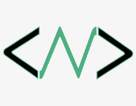

# Hello-World

  
   

  <h3><b>Hello World README</b></h3>

# 📗 Table of Contents

- [📖 About the Project](#about-project)
  - [🛠 Built With](#built-with)
- [💻 Getting Started](#getting-started)
- [👥 Authors](#authors)
- [🔭 Future Features](#future-features)
- [🤝 Contributing](#contributing)
- [⭐️ Show your support](#support)
- [🙏 Acknowledgements](#acknowledgements)
- [📝 License](#license)

# 📖 Hello World 

**Hello World** is a project that displays a header in color, created to learn how to setup a project properly

## 🛠 Built With 

- html
- css

### Key Features 

- **Display a header in color**

(<a href="#readme-top">back to top</a>)

## 💻 Getting Started 

The user can benefit from this project by looking at and learning the elements needed to create a project correctly

To get a local copy up and running, follow these steps.

(<a href="#readme-top">back to top</a>)

## 👥 Authors 

👤 **Christian Nualart**

- GitHub: [@githubhandle](https://github.com/cnualartc)
- Twitter: [@twitterhandle](https://twitter.com/Nualart)
- LinkedIn: [LinkedIn](https://linkedin.com/in/cnualart)

(<a href="#readme-top">back to top</a>)

## 🔭 Future Features 

- [Add a header] **[new_feature_1]**
- [Give color to the header] **[new_feature_2]**
- [Add linters, .gitignore, node_modules] **[new_feature_3]**

(<a href="#readme-top">back to top</a>)

## ⭐️ Show your support 

If you like this project please follow me on github and contribute to the projects you are interested in.

(<a href="#readme-top">back to top</a>)

## 🙠Acknowledgments 

I would like to thank Ruben for helping me clear some doubts that I was having about the project

(<a href="#readme-top">back to top</a>)

## 📠License 

This project is [MIT](./LICENSE) licensed.

(<a href="#readme-top">back to top</a>)
